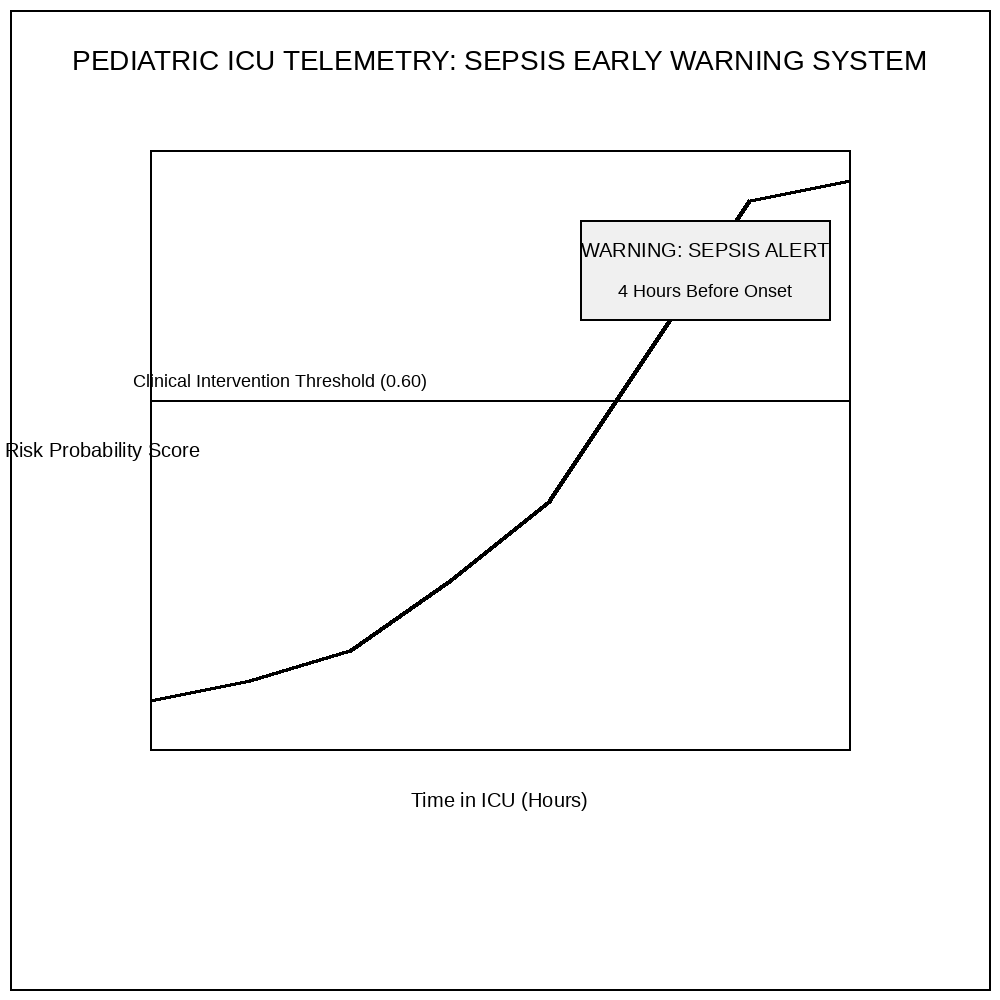
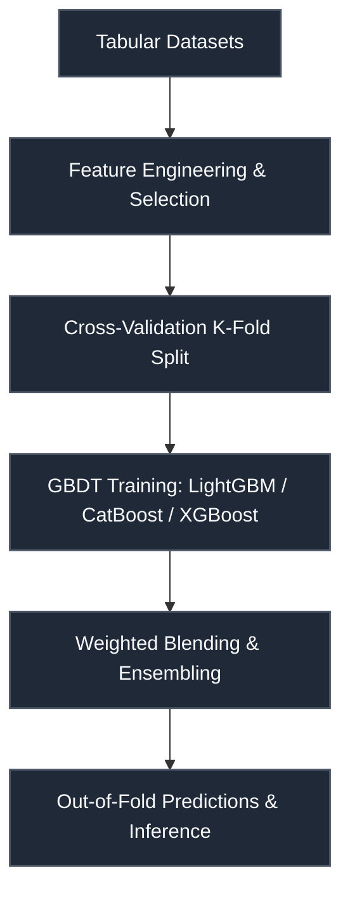

# PHEMS Hackathon — Pediatric Sepsis Early Prediction

 

> **Host:** [`PHEMS Consortium`]  
> **Platform Link:** [Kaggle Competition](https://www.kaggle.com/competitions/phems-hackathon)  
> **Dataset Link:** [Kaggle Dataset](https://www.kaggle.com/competitions/phems-hackathon/data)  
> **Domain:** `ICU & Critical Care AI`

## Overview

This repository contains the developmental workspace and notebooks for the **PHEMS Hackathon — Pediatric Sepsis Early Prediction** project. The primary focus of this project is in the domain of **ICU & Critical Care AI** on PHEMS Consortium. The codebase represents an iterative implementation of machine learning pipelines, structured to process datasets, train models, and validate predictions.

### Technical Methodology & Implementation

The codebase features a total of 11 cells across 1 notebook(s). The system implements several key architectural elements:
- **Key Algorithms & Utilities**: Procedural helpers and utilities facilitate operations, notably: `get_feats`, `get_next_day`, `seed_everything`.
- **Training & Optimization**: Includes cross-validation strategy for stable predictions.

## System Architecture

## Notebook Architecture

### Inference & Submission

| Notebook / Script | Type | Versions | Average Size | Core Stack / Techniques |
| :--- | :--- | :--- | :--- | :--- |
| [LightGBM_LightGBM_XGBoost_XGBoost_CatBoost_SVM_Inference](./Inference%20%26%20Submission/LightGBM_LightGBM_XGBoost_XGBoost_CatBoost_SVM_Inference.ipynb) | Single Notebook | v1 | 29 KB | CatBoost, LightGBM, Scikit-Learn, XGBoost |

## Navigation Guidelines

> **Stage Guidelines**
>
- **EDA & Preprocessing**: Verify data loaders and inspect class distributions before model design.
- **Training & Validation**: Check training runs, loss curves, and model validation scores to evaluate performance.
- **Inference & Ensembling**: Run predictions on testing files and verify submission formatting.

---

> "Sepsis is a silent predator; the algorithm races against the fading pulse."
>
> — **Vigneshwaran S**
